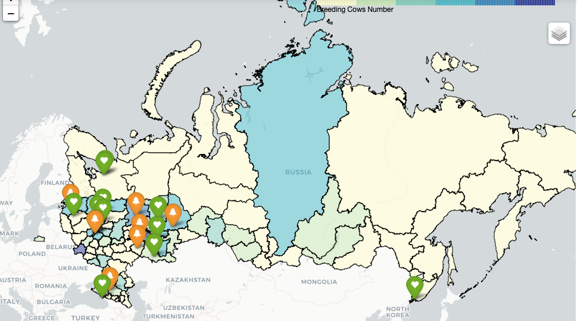

# ClientsMap
This code will allow you to map your customers and competitors.

# Input files
As an input file you have to use your own file with the Clients information (Client's.xlsx) and your own file with the Competitors information (Comp.xls).For making region color painting you can use the file with information about cows number per Russia regions (RusRegCows.xlsx). 

# Results
As a result you have to have Html file with the map.

Enjoy!

## Authors

Kateryna Pantiukh

## License

This project is licensed under the MIT License - see the LICENSE.md file for details
